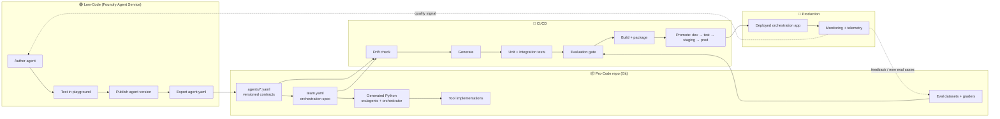
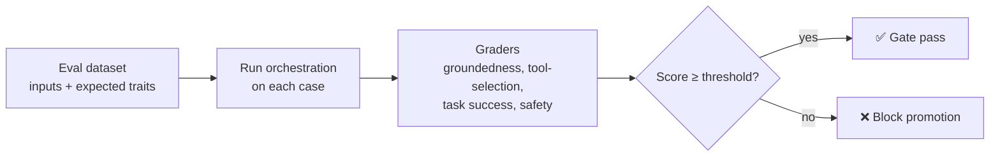
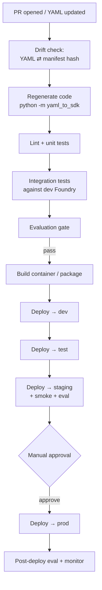
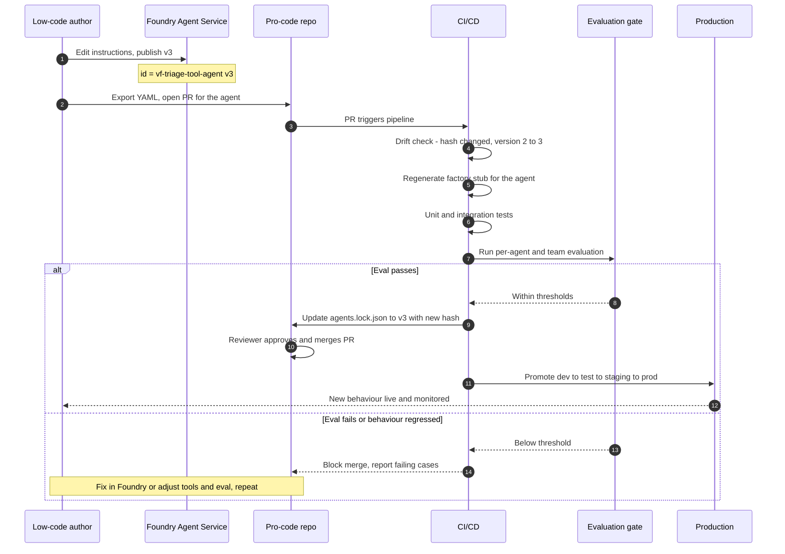

# Low-Code → Pro-Code: End-to-End Workflow & Change Management

This document describes the **complete lifecycle** of an agent-based solution built with the
Low-Code-to-Pro-Code pattern — from a business user authoring an agent in **Microsoft Foundry
Agent Service**, through **YAML hand-off**, **orchestration design**, **code generation**,
**evaluation**, and **CI/CD to production** — and, critically, how a change made by a low-code
author **propagates** all the way to the production application.

> TL;DR: Foundry Agent Service is the **source of truth for individual agent definitions**.
> The pro-code repository is the **source of truth for orchestration, tool logic, evaluation,
> and deployment**. A versioned YAML file is the **contract** between the two worlds. Every
> change flows through Git, is regenerated deterministically, is re-evaluated, and is promoted
> through environments by CI/CD.

---

## 1. Personas & responsibilities

| Persona | Owns | Works in |
| --- | --- | --- |
| **Low-code author** (business SME / citizen developer) | Agent instructions, model choice, tool contracts, knowledge sources | Foundry Agent Service (portal) |
| **Pro-code / platform engineer** | Orchestration pattern, tool implementations, wiring, non-functionals | This repo (`yaml_to_sdk`, generated projects) |
| **ML / evaluation engineer** | Eval datasets, graders, quality gates | Evaluation pipeline |
| **DevOps / SRE** | CI/CD, environments, promotion, rollback, monitoring | Pipelines + Azure |
| **Product / change owner** | Approvals, changelog, release sign-off | Git PRs / work items |

A single change often touches several personas — the workflow below is designed so that each
hand-off is an explicit, reviewable, versioned artifact rather than a manual copy-paste.

---

## 2. The big picture



The rest of this document walks each stage in detail.

---

## 3. Stage 1 — Author the agent (Low-Code, Foundry Agent Service)

The low-code author works entirely in the Foundry Agent Service portal:

1. **Create the agent** — name, description, model deployment (e.g. `gpt-5`), and system
   instructions.
2. **Define tool contracts** — function tools (name, description, JSON-Schema parameters,
   `strict` mode) and/or MCP / knowledge-base tools (server URL + project connection).
3. **Configure reasoning** — e.g. `reasoning.effort: low|medium|high`.
4. **Test in the playground** — iterate on prompt and tool contracts until behaviour is right.
5. **Publish a version** — Foundry assigns a monotonically increasing version.

The author is responsible for **the contract**, not the implementation. Function tools are
declared as schemas; the actual business logic (calling an ITSM system, network telemetry API,
etc.) is implemented later by pro-code engineers.

---

## 4. Stage 2 — Export & share the YAML (the contract)

Each published agent version can be exported as a declarative YAML. This is the **hand-off
artifact**. Its header carries the versioning anchors:

```yaml
object: agent.version
id: vf-triage-tool-agent:2      # <name>:<version>
name: vf-triage-tool-agent
version: "2"                     # Foundry version integer
description: "Network fault triage and remediation agent for Vodafone"
created_at: 1779097149

definition:
  kind: prompt
  model: gpt-5
  instructions: | ...
  reasoning:
    effort: low
  tools:
    - type: function
      name: get_incident
      ...
    - type: mcp
      server_label: kb_regulationpolciies_ziw96
      server_url: https://.../mcp?api-version=2025-11-01-Preview
      project_connection_id: kb-regulationpolciies-ziw96
```

**Key fields for change management:**

| Field | Purpose |
| --- | --- |
| `name` | Stable identity of the agent across versions |
| `version` | Foundry-assigned version integer — increments on every publish |
| `id` (`name:version`) | Fully-qualified, immutable reference to one specific version |
| `definition.*` | The behavioural contract (model, instructions, tools) |

**How it is shared:** the exported YAML is committed to the pro-code repository under a
well-known folder, e.g.:

```
repo/
  agents/
    vf-triage-tool-agent.yaml     # tracks the latest agreed version
    vf-comms-agent.yaml
```

Sharing via **Git (a pull request)** — not email or chat — is what makes the hand-off
auditable and reversible. The PR that lands a new agent YAML is the point where change
management begins (see [§10](#10-change-management--versioning)).

---

## 5. Stage 3 — Decide the orchestration pattern

Multiple agents rarely act alone. The pro-code team chooses **how** the agents cooperate,
using the [Azure AI agent orchestration patterns](https://learn.microsoft.com/en-us/azure/architecture/ai-ml/guide/ai-agent-design-patterns)
as the decision framework. This solution supports four Microsoft Agent Framework
orchestrations:

| Pattern | Coordination | Use when |
| --- | --- | --- |
| **sequential** | Pipeline; each agent consumes the previous output | Clear linear dependencies, progressive refinement |
| **concurrent** | All agents run in parallel; results aggregated | Independent perspectives; latency-sensitive |
| **group_chat** | Shared thread with a chat manager | Consensus-building, maker-checker validation |
| **handoff** | Control transfers dynamically between agents | The right specialist emerges during processing |

The decision is captured as a **team specification** — itself a versioned YAML — that
references the individual agent contracts:

```yaml
# team.yaml
name: vf-triage-team
description: "Triage the fault, then notify customers."
orchestration:
  pattern: sequential
  task: "Handle incident INC-4291 end to end."
  agents:
    - ./agents/vf-triage-tool-agent.yaml
    - ./agents/vf-comms-agent.yaml
  max_rounds: 6          # group_chat
  # start_agent / handoffs  # handoff
```

The `team.yaml` is the **orchestration source of truth**. Changing the pattern, adding an
agent, or re-ordering a pipeline is a change to this file and flows through the same Git +
CI/CD process as an agent change.

---

## 6. Stage 4 — Convert YAML → Python (code generation)

The pro-code engineer runs the generator to turn the declarative contracts into a runnable
Agent Framework project:

```bash
# Team (multi-agent) generation
python -m yaml_to_sdk --team-yaml team.yaml --output-dir generated_agents

# Or straight from agent files + a pattern
python -m yaml_to_sdk \
    --agents agents/vf-triage-tool-agent.yaml agents/vf-comms-agent.yaml \
    --pattern sequential --name vf-triage-team \
    --output-dir generated_agents
```

Generated layout:

```
vf_triage_team/
  src/
    orchestrator.py        # build_workflow() wires the chosen pattern
    config.py              # env-driven configuration
    agents/
      vf_triage_tool_agent.py   # factory: create_vf_triage_tool_agent(client)
      vf_comms_agent.py         # factory: create_vf_comms_agent(client)
  tests/
    test_team.py
  pyproject.toml
  requirements.txt
  .env.example
  Dockerfile
  README.md
```

What the generator produces per agent:

- A **factory function** that builds an `Agent` with its instructions and tools.
- **Typed tool stubs** (`@tool`-decorated functions) with `TODO` bodies.
- **MCP / knowledge tools** wired as `MCPStreamableHTTPTool`.

The orchestrator's `build_workflow()` selects the correct Agent Framework builder
(`SequentialBuilder`, `ConcurrentBuilder`, `GroupChatBuilder`, or `HandoffBuilder`) based on
the pattern chosen in `team.yaml`.

> **Treat generated code as generated.** Files under `src/agents/` and `src/orchestrator.py`
> are deterministic outputs of the YAML. Do not hand-edit their structure; instead, put
> business logic where regeneration won't clobber it (next stage).

---

## 7. Stage 5 — Implement tools & stitch the solution

The generated factories contain tool **stubs**. To keep hand-written logic safe from
regeneration, separate *generated structure* from *implementation*:

```
src/
  agents/                 # GENERATED — do not edit by hand
    vf_triage_tool_agent.py
  tools_impl/             # HAND-WRITTEN — never overwritten by the generator
    incident.py           # get_incident(), fetch_telemetry(), ...
    change.py             # apply_change(), ...
    comms.py              # draft_notification(), notify_customers(), ...
```

Recommended pattern: the generated stub delegates to a stable implementation module, so a
regeneration only rewrites the thin stub:

```python
# src/agents/vf_triage_tool_agent.py  (generated stub)
from src.tools_impl import incident

@tool
async def get_incident(incident_id: Annotated[str, "Incident ID"]) -> dict:
    return await incident.get_incident(incident_id)   # <- your logic lives here
```

This “generated shell delegates to hand-written core” convention is the single most
important design decision for smooth change management: **regeneration is safe and boring.**

The engineer then:

1. Implements each tool in `tools_impl/`.
2. Adds non-functionals: auth, retries/timeouts, structured logging, guardrails.
3. Confirms `build_workflow()` reflects the intended pattern (managers, handoff routing, etc.).
4. Runs the app locally (`python -m src.orchestrator`) against dev resources.

---

## 8. Stage 6 — Evaluation pipeline

Because agent outputs are **non-deterministic**, quality is verified with scored evaluations
rather than exact-match assertions.



Artifacts that live in the repo and are versioned alongside the agents:

- `eval/datasets/*.jsonl` — representative tasks per agent **and** per team flow.
- `eval/graders/*` — rubric / LLM-as-judge / custom scorers.
- `eval/thresholds.yaml` — minimum passing scores per metric (the **quality gate**).

The evaluation runs at two levels:

1. **Per-agent** — does each agent still satisfy its contract?
2. **End-to-end (team)** — does the orchestration produce the right business outcome?

The eval results are stored as a **build artifact** and attached to the PR / release, giving a
quality record for every version.

---

## 9. Stage 7 — CI/CD path to production

Every push and PR runs the pipeline. Promotion is gated on tests **and** evaluation.



Pipeline stages in words:

1. **Drift check** — fail the build if the committed generated code doesn't match what the
   current YAML would produce (see [§10.3](#103-drift-detection-in-ci)). This guarantees the
   Python always reflects the contract.
2. **Regenerate** — run the generator so the build uses fresh output; hand-written
   `tools_impl/` is untouched.
3. **Tests** — unit tests for tool logic; integration tests for the orchestration.
4. **Evaluation gate** — run the eval suite; block if any metric is below threshold.
5. **Build & package** — container image (the generated `Dockerfile`) or module artifact.
6. **Promote** — deploy to **dev → test → staging → prod**, with automated smoke tests and
   (at least at staging) a full eval run. Production requires a **manual approval**.
7. **Post-deploy** — run a canary eval and wire monitoring/telemetry.

Environments each have their own Foundry endpoint/model deployment and configuration via
environment variables (`FOUNDRY_PROJECT_ENDPOINT`, `FOUNDRY_MODEL`, …).

---

## 10. Change management & versioning

This is the heart of the workflow: **what happens when a low-code author changes an agent?**

### 10.1 Versioning model

Three independent version streams, all reconciled in Git:

| Level | Version source | Example |
| --- | --- | --- |
| **Agent** | Foundry `version` integer (in the YAML) | `vf-triage-tool-agent:3` |
| **Team / orchestration** | Semantic version of `team.yaml` | `vf-triage-team v1.4.0` |
| **Release** | Git tag on the deployed solution | `v2026.07.0` |

A **manifest / lockfile** ties them together and records the content hash of each YAML so the
system can detect *any* change, not just a version bump:

```json
// agents.lock.json  (committed, machine-generated)
{
  "team": { "name": "vf-triage-team", "version": "1.4.0" },
  "agents": [
    { "name": "vf-triage-tool-agent", "version": "2", "sha256": "9f3c…", "source": "agents/vf-triage-tool-agent.yaml" },
    { "name": "vf-comms-agent",       "version": "1", "sha256": "1a7e…", "source": "agents/vf-comms-agent.yaml" }
  ],
  "pattern": "sequential",
  "generated_at": "2026-07-21T10:00:00Z"
}
```

### 10.2 The propagation flow (a low-code change reaching production)

Suppose the low-code author edits the triage agent's instructions and republishes it as
**version 3**.



**Step-by-step:**

1. **Author publishes v3** in Foundry. The `version` becomes `3` and `id` becomes
   `vf-triage-tool-agent:3`. Nothing in production changes yet — Foundry is the contract
   source, not the runtime for the orchestration.
2. **Export & PR.** The updated YAML is committed to `agents/` via a pull request. The PR is
   the **change record** (who, what, why, when).
3. **CI detects the change.** The drift check compares the YAML's content hash against
   `agents.lock.json`. A changed hash (and/or a bumped `version`) marks the agent as
   *modified* and forces regeneration + full evaluation — you cannot merge a changed contract
   without re-qualifying it.
4. **Regenerate.** Only the affected generated stub(s) change. Hand-written `tools_impl/`
   stays intact, so no business logic is lost. If the change **added or renamed a tool**, the
   regenerated stub will reference an implementation that doesn't exist yet → tests fail loudly,
   signalling the engineer to implement it. This is the safety net that prevents silent breakage.
5. **Re-run evaluation.** Both the per-agent and the end-to-end team evals run again against
   the new behaviour. Instruction changes frequently shift outputs, so this gate is mandatory.
6. **Promote or block.** If evals pass, `agents.lock.json` is updated and the PR merges;
   CI promotes through environments to production behind a manual approval. If evals fail, the
   PR is blocked with the failing cases attached, and the change loops back to the author or
   the pro-code team.

### 10.3 Drift detection in CI

Drift = the committed generated code (or lockfile) no longer matches what the current YAML
would produce. The CI step regenerates into a temp dir and diffs:

```bash
python -m yaml_to_sdk --team-yaml team.yaml --output-dir .ci_generated --force
# Compare structural (generated) files against committed ones; ignore tools_impl/.
git diff --no-index --exit-code src/agents .ci_generated/*/src/agents
# Recompute agent hashes and compare to agents.lock.json
python scripts/check_lock.py agents/ agents.lock.json
```

If drift is found, the build fails with a clear message: *“YAML changed but generated code /
lockfile is stale — run the generator and commit.”* This makes “the code always reflects the
contract” a mechanically enforced invariant rather than a hope.

### 10.4 Which changes require what

| Change made by low-code author | Regenerate? | Re-implement tools? | Re-evaluate? | Typical version bump |
| --- | --- | --- | --- | --- |
| Instruction / prompt wording | Yes (stub prompt) | No | **Yes** (behaviour shift) | Agent minor |
| Model or reasoning effort | Yes | No | **Yes** | Agent minor |
| Add / rename a function tool | Yes | **Yes** (new impl) | **Yes** | Agent major |
| Change a tool's parameters | Yes | Likely | **Yes** | Agent major |
| Add / change an MCP source | Yes | No (config) | **Yes** | Agent minor |
| Orchestration pattern change (`team.yaml`) | Yes (orchestrator) | No | **Yes** (flow-level) | Team major |

### 10.5 Rollback

Because everything is versioned in Git and images are immutable:

- **Fast rollback:** redeploy the previous release tag / container image — production returns
  to the last known-good version in minutes.
- **Contract rollback:** revert the PR that introduced the new agent YAML; CI regenerates and
  re-evaluates the prior version, restoring `agents.lock.json`.
- Foundry retains historical versions (`name:1`, `name:2`, …), so the exact prior contract is
  always recoverable.

### 10.6 Governance & audit

- Every change is a **pull request** with a reviewer and a linked work item.
- The **evaluation report** is attached to each PR/release as the quality evidence.
- `agents.lock.json` + Git history provide a complete, timestamped audit trail of *which agent
  version, at which content hash, was deployed in which release.*
- Optional: require the low-code author to include a short **change note** (what changed and
  why) in the PR description so downstream teams understand intent.

---

## 11. Roles across the lifecycle (RACI summary)

| Activity | Low-code author | Pro-code eng | Eval eng | DevOps |
| --- | --- | --- | --- | --- |
| Author / publish agent | **R/A** | C | I | I |
| Export & PR the YAML | **R** | C | I | I |
| Choose orchestration pattern | C | **R/A** | C | I |
| Generate + implement tools | I | **R/A** | I | I |
| Build eval datasets & gates | C | C | **R/A** | I |
| CI/CD & promotion | I | C | C | **R/A** |
| Approve production release | C | C | C | **A** |
| Rollback | I | C | I | **R/A** |

*(R = Responsible, A = Accountable, C = Consulted, I = Informed.)*

---

## 12. Challenges & gaps in this approach

This pattern is powerful, but it is not free of friction. The items below are the honest,
known weak points to plan for — grouped by theme. Treat them as a risk register, not a reason
to avoid the approach.

### 12.1 Contract & code-generation gaps

- **Round-trip is one-way.** Foundry → YAML → Python is well supported, but there is **no
  reverse sync**. If a pro-code engineer discovers the prompt or a tool schema needs to change,
  they cannot push it back into Foundry automatically — the author must re-edit in the portal,
  or the two definitions drift. There is no single "edit anywhere" experience.
- **Generator/API version skew.** Generated code targets a specific Microsoft Agent Framework
  surface (`agent_framework.orchestrations` builders, `MCPStreamableHTTPTool`, etc.). Framework
  releases can rename or move these APIs, so previously-generated projects can break on
  dependency upgrades. The generator and the framework must be version-pinned and upgraded
  deliberately.
- **YAML schema coverage is partial.** Foundry can express capabilities the generator does not
  yet map (e.g. hosted tools, code interpreter, file search, connected agents, structured
  outputs, safety/guardrail config, voice). Unmapped fields are silently ignored, creating a
  gap between what the author configured and what the code actually does.
- **Stub/implementation binding is by convention, not enforced.** The "generated stub delegates
  to `tools_impl/`" split relies on discipline. Nothing stops an engineer editing a generated
  file directly; when that happens, the next regeneration silently discards their work unless
  drift detection catches it.
- **Renames are treated as delete + add.** If an author renames an agent or a tool, the
  generator produces new symbols and orphans the old implementation. There is no rename
  refactoring — history and wiring must be fixed by hand.

### 12.2 Orchestration & runtime gaps

- **Pattern choice is a human judgement call.** Nothing validates that the chosen pattern suits
  the agents. A poorly matched pattern (e.g. `concurrent` where agents actually depend on each
  other) produces working-but-wrong behaviour that only evaluation might catch.
- **Cross-agent contract coupling is invisible.** In `sequential`/`handoff` flows, one agent's
  output implicitly becomes another's input. The YAML contracts don't express this coupling, so
  a compatible-looking change to one agent can break a downstream agent with no static signal.
- **Non-determinism makes flows hard to reason about.** `handoff` routing and `group_chat`
  speaker selection are model-driven; the same input can take different paths. Debugging,
  reproducing incidents, and writing stable tests are all harder than in deterministic code.
- **Context growth and cost.** Every agent hop adds tokens (instructions, history, tool
  results). Multi-agent flows can blow past context limits and multiply cost/latency; there is
  no built-in budget guard in the generated scaffold.
- **Partial-failure semantics are the engineer's problem.** The scaffold doesn't provide
  timeouts, retries, circuit breakers, or graceful degradation between agents — these must be
  added in `tools_impl/` and the orchestrator, or a single flaky agent stalls the whole flow.

### 12.3 Evaluation gaps

- **Eval datasets are the bottleneck.** The quality gate is only as good as its cases. Building
  and maintaining representative per-agent **and** end-to-end datasets is labour-intensive and
  is often where teams under-invest.
- **Non-deterministic scoring is itself noisy.** LLM-as-judge graders drift and can be flaky,
  producing false pass/fail. Thresholds need calibration and periodic re-validation, otherwise
  the gate erodes trust.
- **Combinatorial explosion.** With N agents and multiple patterns, the number of interactions
  to evaluate grows quickly. Full end-to-end eval on every change can become slow and expensive,
  tempting teams to weaken the gate.
- **Eval/prod divergence.** Evaluations run against fixed datasets and a specific model
  deployment; production sees live data and possibly a differently-versioned model. Passing
  evals does not guarantee production behaviour.

### 12.4 Change-management & versioning gaps

- **Lockfile and drift tooling are conventions to build, not built-ins.** `agents.lock.json`,
  the hash check, and the CI drift step described in §10 are a *recommended* design — this repo
  ships the generator, not the lockfile/CI scripts. Until a team implements them, propagation is
  manual and error-prone.
- **Silent semantic changes.** An instruction reworded without changing any tool schema is a
  major behavioural change that a schema-diff won't flag as "breaking." Only evaluation catches
  it — so skipping or weakening evals is genuinely dangerous here.
- **Version-stream reconciliation is manual.** Foundry's integer versions, the team's semver,
  and release tags are three separate clocks. Keeping them coherent (and meaningful) depends on
  process discipline.
- **Author feedback loop is long.** A low-code author who makes a small change may not see it in
  production for hours/days as it clears review, tests, evals, and promotion — which can feel
  slow to citizen developers used to instant portal edits.
- **Environment/config sprawl.** Each environment needs its own Foundry endpoint, model
  deployment, connection IDs, and secrets. MCP `project_connection_id`s and URLs are
  environment-specific and easy to get wrong across dev/test/staging/prod.

### 12.5 Governance, security & organisational gaps

- **Least-privilege across agents is hard.** Each agent may need broad tool/knowledge access but
  must not leak data the end user can't see. Security trimming has to be implemented in *every*
  agent and tool — a per-agent responsibility with no framework-level guarantee.
- **Identity propagation.** Carrying the end-user's identity through a multi-agent flow (so each
  tool call is authorised as that user) is non-trivial and not handled by the scaffold.
- **Two-team ownership friction.** The contract sits with low-code authors; the runtime with
  pro-code engineers. Unclear ownership of "who fixes a bad answer" (prompt vs tool vs
  orchestration) can cause finger-pointing without the RACI in §11 being actively enforced.
- **Guardrails must be applied at multiple points.** Input, tool calls, tool responses, and
  final output can each introduce or propagate unsafe content; the scaffold doesn't wire content
  safety by default.
- **Auditability depends on telemetry you must add.** End-to-end tracing across agents and tool
  calls is essential for compliance and debugging but is not generated automatically — it has to
  be instrumented.

### 12.6 Mitigations at a glance

| Gap | Practical mitigation |
| --- | --- |
| One-way round-trip | Keep Foundry as the *sole* editor of contracts; forbid hand-editing generated prompt/schema |
| Generator/API skew | Pin `agent-framework` and generator versions; upgrade behind the eval gate |
| Partial schema coverage | Maintain a "supported fields" doc; fail generation loudly on unknown critical fields |
| Stub overwrite | Enforce the `tools_impl/` split with drift detection in CI (§10.3) |
| Semantic-only changes | Make end-to-end evaluation a **required**, non-skippable gate |
| Lockfile not built-in | Implement `agents.lock.json` + `check_lock.py` early; don't defer it |
| Cost/context growth | Add token budgets, context compaction, and per-run cost monitoring |
| Reliability | Add timeouts/retries/circuit-breakers in `tools_impl/` and the orchestrator |
| Security trimming & identity | Standardise an auth/identity helper reused by every tool |
| Observability | Wire OpenTelemetry tracing into the orchestrator template as a standard |

---

## 13. Summary

1. **Foundry Agent Service** is the source of truth for **individual agent contracts**; each
   published version is exported as a **versioned YAML**.
2. The **pro-code repo** owns **orchestration, tool logic, evaluation, and deployment**, with
   `team.yaml` as the orchestration contract.
3. The **generator** deterministically turns YAML into Agent Framework Python; generated code
   is disposable, hand-written `tools_impl/` is durable.
4. **Evaluation gates** qualify every change; **CI/CD** promotes through environments to prod.
5. **Change management** is enforced by Git, a **hash-based lockfile**, **drift detection**, and
   **mandatory re-evaluation** — so a low-code author's edit propagates safely and traceably
   from Foundry all the way to the production app, and can be rolled back at any time.

## References

- [AI agent orchestration patterns (Azure Architecture Center)](https://learn.microsoft.com/en-us/azure/architecture/ai-ml/guide/ai-agent-design-patterns)
- [Microsoft Agent Framework workflow orchestrations](https://learn.microsoft.com/en-us/agent-framework/workflows/orchestrations/)
