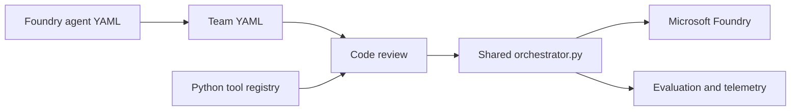

# End-to-End Workflow

## Operating model

Foundry agent definitions remain declarative YAML. Pro-code assets supply reviewed orchestration topology, executable tools, tests, identity, and deployment controls. The shared runtime reads those assets directly; it does not generate an SDK project.



## Authoring

1. Export or author each agent YAML under a team `agents/` directory.
2. Declare model, instructions, function-tool names, and MCP endpoints in each agent file.
3. Define agent order and orchestration behavior in `team.yaml`.
4. Implement function tools in `src/tools.py` and expose them through `TOOL_REGISTRY`.
5. Configure the Foundry project endpoint in the team-local `.env`.

Example team definition:

```yaml
name: billing-team
runtime:
  env_file: ./.env
  tools_file: ./src/tools.py
orchestration:
  pattern: sequential
  chain_only_agent_responses: true
  agents:
    - ./agents/profile_agent.yaml
    - ./agents/investigation_agent.yaml
    - ./agents/response_agent.yaml
  task: Handle the billing request.
```

## Local verification

Install once at repository scope:

```powershell
python -m pip install -r requirements.txt
```

Run shared contract tests:

```powershell
python -m pytest tests/test_orchestrator.py -q
```

Run a team directly:

```powershell
python orchestrator.py --team-yaml generated_agents/vf_billing_team/team.yaml
```

No regeneration is required after changing `team.yaml` or `agents/*.yaml`. Restarting the process reloads all YAML and the tool registry.

## Sequential data flow

For a sequential team, list agents in execution order. `chain_only_agent_responses: true` causes stage $n+1$ to receive only stage $n$'s response. Intermediate agents should return structured JSON that preserves every value needed downstream.

The runtime strips cross-agent reasoning and function-call transport items before each model call. User-visible text remains available to the next agent, while tool execution stays inside the agent that owns the tool.

## Pull request checks

A change should verify:

- Every team YAML references files that exist.
- Every declared function tool exists in `TOOL_REGISTRY`.
- Sequential agent order matches the documented input/output contracts.
- `.env` files and credentials remain untracked.
- Shared runtime tests pass.
- At least one relevant live smoke test succeeds when Foundry access is available.

## Deployment

Package or containerize the repository-level runtime with the selected team directories. Supply `FOUNDRY_PROJECT_ENDPOINT` through the deployment environment or a secret-backed configuration provider. Invoke the same entry point used locally:

```powershell
foundry-team --team-yaml <path-to-team.yaml>
```

The deployment artifact contains one orchestration implementation and any number of team definitions.
